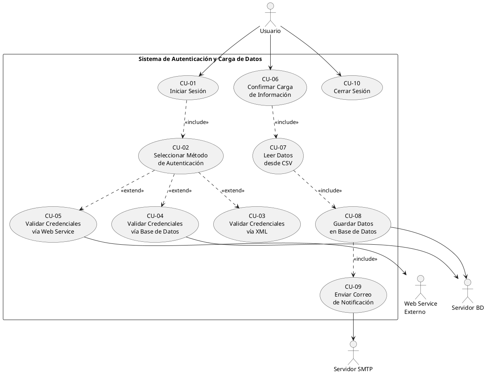
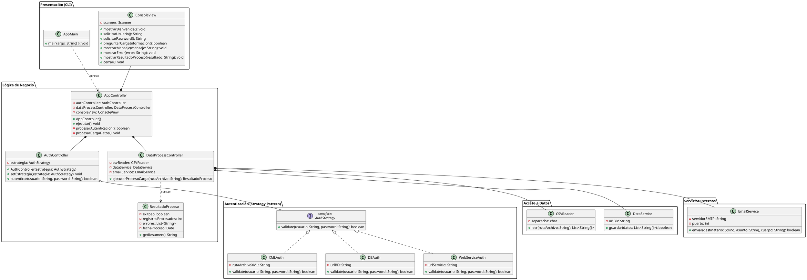
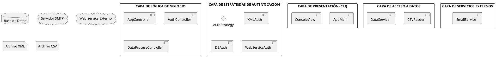
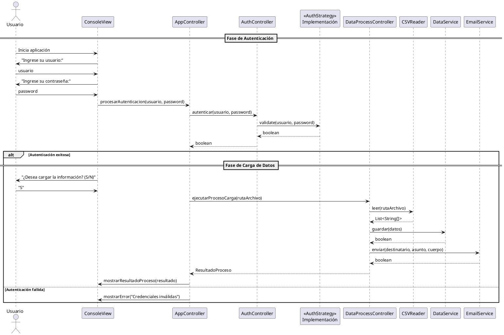

# Diseño UML — Sistema de Autenticación y Carga de Datos

> **Proyecto:** TallerIS — Taller de Ingeniería de Software  
> **Versión:** 1.0  
> **Fecha:** Abril 2026  
> **Autor:** Equipo de Desarrollo

---

## Tabla de Contenidos

1. [Diagrama de Casos de Uso](#1-diagrama-de-casos-de-uso)
2. [Diagrama de Clases](#2-diagrama-de-clases)
3. [Diagrama de Arquitectura](#3-diagrama-de-arquitectura)
4. [Diagrama de Secuencia](#4-diagrama-de-secuencia)
5. [Historias de Usuario](#5-historias-de-usuario)
6. [Prototipo de Consola (CMD)](#6-prototipo-de-consola-cmd)
7. [Explicación de Patrones de Diseño](#7-explicación-de-patrones-de-diseño)
8. [Justificación del Diseño](#8-justificación-del-diseño)

---

## 1. Diagrama de Casos de Uso

### 1.1 Actores Identificados

| Actor | Tipo | Descripción |
|---|---|---|
| **Usuario** | Principal | Persona que interactúa con el sistema a través de la consola. Proporciona credenciales y decide si desea cargar información. |
| **Servidor de Base de Datos** | Secundario | Sistema externo que almacena las credenciales de usuarios y los datos procesados desde el archivo CSV. |
| **Servidor SMTP** | Secundario | Sistema externo encargado del envío de correos electrónicos con el resultado del proceso de carga. |
| **Web Service Externo** | Secundario | Servicio externo que provee autenticación de credenciales a través de una API REST o SOAP. |

### 1.2 Lista de Casos de Uso

| ID | Caso de Uso | Descripción |
|---|---|---|
| CU-01 | Iniciar Sesión | El usuario ingresa sus credenciales (usuario y contraseña) para autenticarse en el sistema. |
| CU-02 | Seleccionar Método de Autenticación | El sistema determina dinámicamente la fuente de autenticación (XML, BD o Web Service) según la configuración activa. |
| CU-03 | Validar Credenciales vía XML | El sistema valida las credenciales del usuario leyendo un archivo XML con datos de usuarios registrados. |
| CU-04 | Validar Credenciales vía Base de Datos | El sistema valida las credenciales consultando directamente una base de datos relacional. |
| CU-05 | Validar Credenciales vía Web Service | El sistema valida las credenciales enviando una petición a un servicio web externo. |
| CU-06 | Confirmar Carga de Información | Tras autenticarse exitosamente, el sistema pregunta al usuario si desea iniciar el proceso de carga de datos. |
| CU-07 | Leer Datos desde CSV | El sistema lee y parsea un archivo CSV con los datos a procesar. |
| CU-08 | Guardar Datos en Base de Datos | El sistema persiste los datos leídos del CSV en una base de datos relacional. |
| CU-09 | Enviar Correo de Notificación | El sistema envía un correo electrónico al usuario informando el resultado del proceso de carga. |
| CU-10 | Cerrar Sesión | El usuario finaliza su sesión y el sistema libera los recursos utilizados. |

### 1.3 Diagrama PlantUML

> El archivo fuente se encuentra en: [`docs/diagramas/casos_de_uso.puml`](diagramas/casos_de_uso.puml)



### 1.4 Descripción Detallada de Casos de Uso Principales

#### CU-01: Iniciar Sesión

| Campo | Descripción |
|---|---|
| **Actor principal** | Usuario |
| **Precondición** | El sistema está en ejecución y la estrategia de autenticación ha sido configurada. |
| **Flujo principal** | 1. El sistema solicita el nombre de usuario. 2. El usuario ingresa su nombre de usuario. 3. El sistema solicita la contraseña. 4. El usuario ingresa su contraseña. 5. El sistema valida las credenciales usando la estrategia activa. 6. El sistema muestra un mensaje de éxito. |
| **Flujo alternativo** | 5a. Las credenciales son inválidas → el sistema muestra un mensaje de error y permite reintentar. |
| **Postcondición** | El usuario queda autenticado en el sistema. |

#### CU-06: Confirmar Carga de Información

| Campo | Descripción |
|---|---|
| **Actor principal** | Usuario |
| **Precondición** | El usuario se ha autenticado exitosamente. |
| **Flujo principal** | 1. El sistema pregunta "¿Desea cargar la información? (S/N)". 2. El usuario responde "S". 3. El sistema ejecuta el proceso de carga (CU-07, CU-08, CU-09). 4. El sistema muestra el resultado. |
| **Flujo alternativo** | 2a. El usuario responde "N" → el sistema muestra un mensaje de cancelación. |
| **Postcondición** | Los datos han sido cargados en la BD y se ha enviado un correo de notificación. |

---

## 2. Diagrama de Clases

### 2.1 Visión General

El diseño utiliza el **patrón Strategy** para la autenticación, lo que permite cambiar dinámicamente la fuente de validación de credenciales sin modificar el código del controlador. La arquitectura se organiza en paquetes que reflejan la separación de responsabilidades.

### 2.2 Diagrama PlantUML

> El archivo fuente se encuentra en: [`docs/diagramas/diagrama_clases.puml`](diagramas/diagrama_clases.puml)



### 2.3 Descripción de Clases e Interfaces

#### Interfaz `AuthStrategy`

```
<<interface>> AuthStrategy
─────────────────────────────────────────
+ validate(usuario: String, password: String): boolean
```

**Propósito:** Define el contrato para todas las estrategias de autenticación. Cualquier nueva fuente de autenticación debe implementar esta interfaz.

#### Clase `XMLAuth` (implementa `AuthStrategy`)

| Atributo / Método | Descripción |
|---|---|
| `rutaArchivoXML: String` | Ruta al archivo XML que contiene las credenciales. |
| `validate(usuario, password): boolean` | Lee el archivo XML, busca el usuario y compara la contraseña. |
| `parsearXML(): Document` | Método privado que parsea el archivo XML a un objeto DOM. |
| `buscarUsuario(doc, usuario): Element` | Método privado que localiza el elemento del usuario en el DOM. |

#### Clase `DBAuth` (implementa `AuthStrategy`)

| Atributo / Método | Descripción |
|---|---|
| `urlBD: String` | URL de conexión a la base de datos. |
| `validate(usuario, password): boolean` | Abre conexión a la BD, ejecuta una consulta SQL para verificar las credenciales. |
| `conectar(): Connection` | Método privado que establece la conexión. |
| `desconectar(): void` | Método privado que cierra la conexión. |

#### Clase `WebServiceAuth` (implementa `AuthStrategy`)

| Atributo / Método | Descripción |
|---|---|
| `urlServicio: String` | URL del endpoint del servicio web. |
| `validate(usuario, password): boolean` | Envía una petición HTTP al web service y parsea la respuesta. |
| `enviarPeticion(usuario, password): Response` | Método privado que construye y envía la petición HTTP. |
| `parsearRespuesta(response): boolean` | Método privado que interpreta la respuesta del servicio. |

#### Clase `AuthController`

| Atributo / Método | Descripción |
|---|---|
| `estrategia: AuthStrategy` | Referencia a la estrategia de autenticación activa (inyectada). |
| `AuthController(estrategia)` | Constructor que recibe la estrategia inicial. |
| `setEstrategia(estrategia): void` | Permite cambiar dinámicamente la estrategia en tiempo de ejecución. |
| `autenticar(usuario, password): boolean` | Delega la validación a la estrategia configurada. |

#### Clase `CSVReader`

| Atributo / Método | Descripción |
|---|---|
| `separador: char` | Carácter separador del archivo CSV (por defecto `,`). |
| `tieneEncabezado: boolean` | Indica si la primera fila del CSV es un encabezado. |
| `leer(rutaArchivo): List<String[]>` | Lee el archivo CSV y retorna una lista de arreglos de strings. |
| `parsearLinea(linea): String[]` | Método privado que divide una línea en campos. |

#### Clase `DataService`

| Atributo / Método | Descripción |
|---|---|
| `urlBD: String` | URL de conexión a la base de datos destino. |
| `nombreTabla: String` | Nombre de la tabla donde se insertan los datos. |
| `guardar(datos): boolean` | Inserta los datos leídos del CSV en la base de datos. |
| `guardarLote(datos, tamanoLote): boolean` | Inserta los datos por lotes para mejorar rendimiento. |

#### Clase `EmailService`

| Atributo / Método | Descripción |
|---|---|
| `servidorSMTP: String` | Dirección del servidor SMTP. |
| `puerto: int` | Puerto del servidor SMTP. |
| `remitente: String` | Dirección de correo del remitente. |
| `enviar(destinatario, asunto, cuerpo): boolean` | Envía un correo electrónico con el resultado del proceso. |

#### Clase `AppController`

| Atributo / Método | Descripción |
|---|---|
| `authController: AuthController` | Controlador de autenticación. |
| `dataProcessController: DataProcessController` | Controlador del proceso de carga de datos. |
| `consoleView: ConsoleView` | Vista de consola para interacción con el usuario. |
| `ejecutar(): void` | Método principal que orquesta todo el flujo de la aplicación. |
| `procesarAutenticacion(): boolean` | Método privado que gestiona el flujo de autenticación. |
| `procesarCargaDatos(): void` | Método privado que gestiona el flujo de carga de datos. |

#### Clase `DataProcessController`

| Atributo / Método | Descripción |
|---|---|
| `csvReader: CSVReader` | Componente para lectura de archivos CSV. |
| `dataService: DataService` | Componente para persistencia en base de datos. |
| `emailService: EmailService` | Componente para envío de correos electrónicos. |
| `ejecutarProcesoCarga(rutaArchivo): ResultadoProceso` | Orquesta el flujo completo: leer CSV → guardar en BD → enviar correo. |

### 2.4 Relaciones entre Clases

| Relación | Tipo | Descripción |
|---|---|---|
| `AppMain` → `AppController` | Dependencia | `AppMain` crea e inicia `AppController`. |
| `AppController` → `ConsoleView` | Composición | `AppController` posee y controla la vista de consola. |
| `AppController` → `AuthController` | Composición | `AppController` posee el controlador de autenticación. |
| `AppController` → `DataProcessController` | Composición | `AppController` posee el controlador de proceso de datos. |
| `AuthController` → `AuthStrategy` | Agregación | `AuthController` tiene una referencia intercambiable a una estrategia. |
| `XMLAuth`, `DBAuth`, `WebServiceAuth` → `AuthStrategy` | Realización | Las tres clases implementan la interfaz `AuthStrategy`. |
| `DataProcessController` → `CSVReader` | Composición | `DataProcessController` posee el lector de CSV. |
| `DataProcessController` → `DataService` | Composición | `DataProcessController` posee el servicio de datos. |
| `DataProcessController` → `EmailService` | Composición | `DataProcessController` posee el servicio de correo. |
| `DataProcessController` → `ResultadoProceso` | Dependencia | `DataProcessController` crea objetos `ResultadoProceso`. |

---

## 3. Diagrama de Arquitectura

### 3.1 Arquitectura por Capas

El sistema se organiza en cuatro capas claramente definidas, siguiendo el principio de separación de responsabilidades.

> El archivo fuente se encuentra en: [`docs/diagramas/diagrama_arquitectura.puml`](diagramas/diagrama_arquitectura.puml)



### 3.2 Descripción de Capas

#### Capa 1: Presentación (CLI)

| Componente | Responsabilidad |
|---|---|
| `AppMain` | Punto de entrada de la aplicación. Inicializa los componentes y lanza la ejecución. |
| `ConsoleView` | Gestiona toda la entrada/salida por consola: solicita datos al usuario, muestra mensajes y resultados. |

**Principios aplicados:** Separación de la lógica de presentación. La vista no contiene lógica de negocio; solo recoge datos y muestra resultados.

#### Capa 2: Lógica de Negocio

| Componente | Responsabilidad |
|---|---|
| `AppController` | Orquestador principal del flujo de la aplicación. Coordina la autenticación y la carga de datos. |
| `AuthController` | Gestiona la autenticación utilizando el patrón Strategy. Permite cambiar dinámicamente la fuente de validación. |
| `DataProcessController` | Coordina el proceso de carga: lectura de CSV, persistencia en BD y envío de correo. |
| `ResultadoProceso` | Objeto de valor (Value Object) que encapsula el resultado de un proceso de carga. |

**Principios aplicados:** Principio de Responsabilidad Única (SRP), Inversión de Dependencias (DIP), Abierto/Cerrado (OCP).

#### Capa 3: Acceso a Datos

| Componente | Responsabilidad |
|---|---|
| `CSVReader` | Lee y parsea archivos CSV, retornando datos en formato estructurado. |
| `DataService` | Persiste datos en una base de datos relacional. Gestiona conexiones y transacciones. |

**Principios aplicados:** Cada componente tiene una única responsabilidad bien definida dentro del acceso a datos.

#### Capa 4: Servicios Externos

| Componente | Responsabilidad |
|---|---|
| `EmailService` | Encapsula la lógica de envío de correos electrónicos mediante protocolo SMTP. |
| `WebServiceAuth` | Encapsula la comunicación con el servicio web externo para autenticación. |

**Principios aplicados:** Encapsulamiento de la integración con servicios de terceros para aislar al sistema de cambios en APIs externas.

---

## 4. Diagrama de Secuencia

### 4.1 Flujo Principal

> El archivo fuente se encuentra en: [`docs/diagramas/diagrama_secuencia.puml`](diagramas/diagrama_secuencia.puml)

El diagrama de secuencia ilustra el flujo completo del sistema:

1. El usuario inicia la aplicación y se le solicitan sus credenciales.
2. El `AppController` delega la autenticación al `AuthController`.
3. El `AuthController` invoca el método `validate()` de la estrategia configurada.
4. Si la autenticación es exitosa, se pregunta al usuario si desea cargar datos.
5. Si el usuario acepta, el `DataProcessController` orquesta la lectura del CSV, la persistencia en BD y el envío de correo.
6. Se muestra el resultado al usuario.



---

## 5. Historias de Usuario

### HU-01: Autenticación con credenciales

> **Como** usuario del sistema,  
> **quiero** poder ingresar mi nombre de usuario y contraseña en la consola,  
> **para** autenticarme y acceder a las funcionalidades del sistema.

**Criterios de aceptación:**
- El sistema solicita usuario y contraseña por consola.
- Si las credenciales son válidas, se muestra un mensaje de éxito.
- Si las credenciales son inválidas, se muestra un mensaje de error descriptivo.

---

### HU-02: Autenticación flexible mediante múltiples fuentes

> **Como** administrador del sistema,  
> **quiero** poder configurar la fuente de autenticación (XML, base de datos o web service) sin modificar el código,  
> **para** adaptar el sistema a diferentes entornos de despliegue.

**Criterios de aceptación:**
- El sistema permite seleccionar entre al menos tres fuentes de autenticación.
- Cambiar la fuente no requiere recompilar el sistema (se cambia por configuración o inyección).
- La autenticación funciona correctamente con cualquiera de las tres fuentes.

---

### HU-03: Confirmación antes de cargar datos

> **Como** usuario autenticado,  
> **quiero** que el sistema me pregunte si deseo cargar la información antes de ejecutar el proceso,  
> **para** tener control sobre cuándo se ejecuta la carga de datos.

**Criterios de aceptación:**
- Después de una autenticación exitosa, el sistema muestra: "¿Desea cargar la información? (S/N)".
- Si el usuario responde "S" o "s", se inicia el proceso de carga.
- Si el usuario responde "N" o "n", el sistema cancela la operación y muestra un mensaje.

---

### HU-04: Lectura de datos desde archivo CSV

> **Como** sistema,  
> **quiero** leer datos desde un archivo CSV estructurado,  
> **para** obtener la información que será procesada y almacenada.

**Criterios de aceptación:**
- El sistema lee un archivo CSV con separador configurable.
- Se detecta y omite correctamente la fila de encabezado si existe.
- Si el archivo no existe o tiene un formato inválido, se muestra un error descriptivo.

---

### HU-05: Persistencia de datos en base de datos

> **Como** sistema,  
> **quiero** guardar los datos leídos del CSV en una base de datos relacional,  
> **para** que la información quede almacenada de forma persistente y consultable.

**Criterios de aceptación:**
- Los datos se insertan correctamente en la tabla correspondiente.
- Si ocurre un error durante la inserción, se registra y se continúa con los demás registros.
- El resultado indica cuántos registros se procesaron correctamente y cuántos fallaron.

---

### HU-06: Notificación por correo electrónico

> **Como** usuario,  
> **quiero** recibir un correo electrónico con el resultado del proceso de carga,  
> **para** estar informado sobre el éxito o fracaso de la operación sin estar pendiente de la consola.

**Criterios de aceptación:**
- Se envía un correo al finalizar el proceso de carga.
- El correo incluye: fecha, cantidad de registros procesados y estado general (éxito/error).
- Si el envío de correo falla, se muestra un aviso en consola pero no se detiene el proceso.

---

### HU-07: Visualización de resultados en consola

> **Como** usuario,  
> **quiero** ver un resumen del proceso de carga en la consola,  
> **para** conocer de inmediato el resultado de la operación.

**Criterios de aceptación:**
- Se muestra un resumen con: registros leídos, registros guardados, errores encontrados y estado del correo.
- El formato es legible y ordenado.

---

### HU-08: Manejo de errores en autenticación

> **Como** usuario,  
> **quiero** recibir mensajes claros cuando mis credenciales son incorrectas o cuando hay un problema con la fuente de autenticación,  
> **para** entender qué salió mal y poder tomar acción.

**Criterios de aceptación:**
- Si las credenciales son incorrectas, se muestra "Credenciales inválidas".
- Si la fuente de autenticación no está disponible (BD caída, archivo no encontrado, servicio no disponible), se muestra un mensaje específico del error.

---

## 6. Prototipo de Consola (CMD)

### 6.1 Flujo Exitoso Completo

```
╔══════════════════════════════════════════════════════════════╗
║         SISTEMA DE AUTENTICACIÓN Y CARGA DE DATOS           ║
╚══════════════════════════════════════════════════════════════╝

Bienvenido al sistema. Por favor, autentíquese.

Ingrese su usuario: jramirez
Ingrese su contraseña: ********

[INFO] Validando credenciales...
[OK]   Autenticación exitosa. Bienvenido, jramirez.

──────────────────────────────────────────────────────────────
¿Desea cargar la información? (S/N): S

[INFO] Iniciando proceso de carga de datos...
[INFO] Leyendo archivo CSV: datos_entrada.csv
[OK]   Archivo leído correctamente. 150 registros encontrados.

[INFO] Guardando datos en la base de datos...
[OK]   148 registros guardados exitosamente.
[WARN] 2 registros con errores (líneas 45, 89).

[INFO] Enviando correo de notificación a jramirez@correo.com...
[OK]   Correo enviado exitosamente.

══════════════════════════════════════════════════════════════
              RESUMEN DEL PROCESO
══════════════════════════════════════════════════════════════
  Fecha:               2026-04-13 10:30:00
  Registros leídos:    150
  Registros guardados: 148
  Errores:             2
  Correo enviado:      Sí
  Estado general:      COMPLETADO CON ADVERTENCIAS
══════════════════════════════════════════════════════════════

Presione Enter para salir...
```

### 6.2 Flujo con Autenticación Fallida

```
╔══════════════════════════════════════════════════════════════╗
║         SISTEMA DE AUTENTICACIÓN Y CARGA DE DATOS           ║
╚══════════════════════════════════════════════════════════════╝

Bienvenido al sistema. Por favor, autentíquese.

Ingrese su usuario: admin
Ingrese su contraseña: ********

[INFO] Validando credenciales...
[ERROR] Credenciales inválidas. Verifique su usuario y contraseña.

Ingrese su usuario: admin
Ingrese su contraseña: ********

[INFO] Validando credenciales...
[ERROR] Credenciales inválidas. Verifique su usuario y contraseña.

[ERROR] Número máximo de intentos alcanzado (3). Cerrando sesión.

Presione Enter para salir...
```

### 6.3 Flujo con Cancelación de Carga

```
╔══════════════════════════════════════════════════════════════╗
║         SISTEMA DE AUTENTICACIÓN Y CARGA DE DATOS           ║
╚══════════════════════════════════════════════════════════════╝

Bienvenido al sistema. Por favor, autentíquese.

Ingrese su usuario: jramirez
Ingrese su contraseña: ********

[INFO] Validando credenciales...
[OK]   Autenticación exitosa. Bienvenido, jramirez.

──────────────────────────────────────────────────────────────
¿Desea cargar la información? (S/N): N

[INFO] Operación cancelada por el usuario.
[INFO] Cerrando sesión...

Presione Enter para salir...
```

---

## 7. Explicación de Patrones de Diseño

### 7.1 Patrón Strategy

#### ¿Qué es el patrón Strategy?

El patrón **Strategy** es un patrón de diseño de comportamiento que permite definir una familia de algoritmos, encapsular cada uno de ellos y hacerlos intercambiables. Permite que el algoritmo varíe independientemente de los clientes que lo utilizan.

#### ¿Por qué se usa Strategy en este sistema?

El sistema requiere autenticación de usuarios a través de **tres fuentes diferentes** (XML, Base de Datos y Web Service), y el requisito explícito es que **el sistema NO debe estar acoplado a una fuente específica**. Esta es exactamente la problemática que resuelve el patrón Strategy.

```
                    ┌───────────────────┐
                    │  AuthController   │
                    │                   │
                    │ - estrategia ─────┼──────┐
                    │                   │      │
                    │ + autenticar()    │      │
                    └───────────────────┘      │
                                               ▼
                                   ┌───────────────────┐
                                   │ <<AuthStrategy>>   │
                                   │                   │
                                   │ + validate()      │
                                   └───────────────────┘
                                          ▲  ▲  ▲
                              ┌───────────┘  │  └───────────┐
                              │              │              │
                    ┌─────────────┐ ┌─────────────┐ ┌──────────────┐
                    │  XMLAuth    │ │   DBAuth    │ │WebServiceAuth│
                    │             │ │             │ │              │
                    │ +validate() │ │ +validate() │ │ +validate()  │
                    └─────────────┘ └─────────────┘ └──────────────┘
```

#### ¿Qué problema resuelve?

| Problema | Solución con Strategy |
|---|---|
| El código de autenticación estaría lleno de condicionales (`if/else`, `switch`) para elegir la fuente. | Cada fuente está encapsulada en una clase independiente con la misma interfaz. |
| Agregar una nueva fuente de autenticación requeriría modificar la clase controladora. | Se crea una nueva clase que implemente `AuthStrategy` sin tocar el código existente (OCP). |
| Las pruebas unitarias serían complicadas al depender de múltiples fuentes. | Cada estrategia puede probarse de forma independiente; se pueden crear mocks fácilmente. |
| El acoplamiento entre el controlador y la fuente de datos sería alto. | El controlador solo conoce la interfaz `AuthStrategy`, no las implementaciones concretas. |

#### Ventajas en este sistema

1. **Intercambiabilidad en tiempo de ejecución:** Se puede cambiar la fuente de autenticación sin detener el sistema, simplemente llamando a `authController.setEstrategia(nuevaEstrategia)`.

2. **Principio Abierto/Cerrado (OCP):** Si en el futuro se necesita autenticación por LDAP, OAuth o biometría, solo se crea una nueva clase que implemente `AuthStrategy`.

3. **Facilidad de pruebas:** Cada estrategia se prueba de forma aislada. Se pueden crear estrategias mock para testing.

4. **Código limpio:** Elimina condicionales complejos en el controlador de autenticación.

5. **Bajo acoplamiento:** El `AuthController` depende de la abstracción (`AuthStrategy`), no de las implementaciones concretas.

#### Pseudocódigo del patrón

```
// Interfaz Strategy
interface AuthStrategy:
    method validate(usuario: String, password: String): boolean

// Estrategia concreta - XML
class XMLAuth implements AuthStrategy:
    method validate(usuario, password):
        documento = parsearXML(rutaArchivoXML)
        elemento = buscarUsuario(documento, usuario)
        if elemento != null AND elemento.password == password:
            return true
        return false

// Estrategia concreta - Base de Datos
class DBAuth implements AuthStrategy:
    method validate(usuario, password):
        conexion = conectar(urlBD)
        resultado = conexion.ejecutar(
            "SELECT * FROM usuarios WHERE nombre = ? AND password = ?",
            usuario, password
        )
        desconectar()
        return resultado.tieneRegistros()

// Estrategia concreta - Web Service
class WebServiceAuth implements AuthStrategy:
    method validate(usuario, password):
        peticion = construirPeticionHTTP(urlServicio, usuario, password)
        respuesta = enviar(peticion)
        return respuesta.codigo == 200 AND respuesta.autenticado == true

// Controlador (Contexto del patrón)
class AuthController:
    private estrategia: AuthStrategy

    method setEstrategia(nuevaEstrategia: AuthStrategy):
        this.estrategia = nuevaEstrategia

    method autenticar(usuario: String, password: String): boolean:
        return this.estrategia.validate(usuario, password)
```

---

## 8. Justificación del Diseño

### 8.1 Separación de Responsabilidades (SRP)

El diseño asigna una **única responsabilidad** a cada clase, cumpliendo con el **Principio de Responsabilidad Única (Single Responsibility Principle)**:

| Clase | Responsabilidad Única |
|---|---|
| `ConsoleView` | Interacción con el usuario por consola. |
| `AuthController` | Gestión y delegación de la autenticación. |
| `XMLAuth` | Validación de credenciales en archivos XML. |
| `DBAuth` | Validación de credenciales en base de datos. |
| `WebServiceAuth` | Validación de credenciales vía web service. |
| `CSVReader` | Lectura y parseo de archivos CSV. |
| `DataService` | Persistencia de datos en base de datos. |
| `EmailService` | Envío de correos electrónicos. |
| `AppController` | Orquestación del flujo general de la aplicación. |
| `DataProcessController` | Orquestación del proceso de carga de datos. |

**Beneficio:** Cada clase tiene una sola razón para cambiar. Si cambia el formato del CSV, solo se modifica `CSVReader`. Si cambia el servidor SMTP, solo se modifica `EmailService`.

### 8.2 Bajo Acoplamiento

El diseño minimiza las dependencias directas entre componentes mediante:

1. **Interfaces:** `AuthStrategy`, `ICSVReader`, `IDataService`, `IEmailService` actúan como contratos que desacoplan las implementaciones concretas de sus consumidores.

2. **Inyección de dependencias:** Los controladores reciben sus dependencias por constructor, no las crean internamente. Esto permite:
   - Sustituir implementaciones fácilmente.
   - Crear mocks para pruebas unitarias.
   - Configurar diferentes comportamientos sin modificar código.

3. **Patrón Strategy:** El `AuthController` no conoce las clases concretas de autenticación; solo trabaja con la interfaz `AuthStrategy`.

```
// ALTO ACOPLAMIENTO (lo que se evita):
class AuthController:
    method autenticar(usuario, password, tipo):
        if tipo == "XML":
            // lógica XML directamente aquí
        else if tipo == "BD":
            // lógica BD directamente aquí
        else if tipo == "WS":
            // lógica WS directamente aquí

// BAJO ACOPLAMIENTO (lo que se implementa):
class AuthController:
    private estrategia: AuthStrategy    // solo conoce la interfaz

    method autenticar(usuario, password):
        return estrategia.validate(usuario, password)    // delega
```

### 8.3 Escalabilidad

El diseño está preparado para crecer sin modificaciones al código existente:

| Escenario de Crecimiento | Impacto en el Diseño |
|---|---|
| Nueva fuente de autenticación (LDAP, OAuth, biometría) | Solo se crea una nueva clase que implemente `AuthStrategy`. No se modifica `AuthController`. |
| Nuevo formato de entrada (JSON, Excel, API REST) | Solo se crea una nueva clase que implemente `ICSVReader` (renombrada a `IDataReader`). |
| Nuevo destino de datos (NoSQL, archivo, API) | Solo se crea una nueva clase que implemente `IDataService`. |
| Nuevo canal de notificación (SMS, Slack, push notification) | Solo se crea una nueva clase que implemente `IEmailService` (renombrada a `INotificationService`). |
| Nueva interfaz de usuario (Web, móvil) | Solo se reemplaza `ConsoleView` por la nueva implementación. `AppController` no cambia. |

### 8.4 Principios SOLID Aplicados

| Principio | Aplicación en el Diseño |
|---|---|
| **S** — Single Responsibility | Cada clase tiene una única responsabilidad bien definida. |
| **O** — Open/Closed | El sistema está abierto a extensión (nuevas estrategias) y cerrado a modificación. |
| **L** — Liskov Substitution | Cualquier implementación de `AuthStrategy` puede sustituir a otra sin afectar el comportamiento. |
| **I** — Interface Segregation | Las interfaces son específicas y enfocadas (`AuthStrategy`, `ICSVReader`, `IDataService`, `IEmailService`). |
| **D** — Dependency Inversion | Los módulos de alto nivel dependen de abstracciones (interfaces), no de implementaciones concretas. |

---

## Anexo: Cómo Generar los Diagramas

Los diagramas están en formato **PlantUML** y pueden ser renderizados de las siguientes formas:

1. **PlantUML Online:** Copiar el contenido `.puml` en [www.plantuml.com/plantuml/uml](http://www.plantuml.com/plantuml/uml)
2. **Visual Studio Code:** Instalar la extensión "PlantUML" y previsualizar con `Alt+D`.
3. **draw.io:** Importar archivos `.puml` desde el menú `Extras > PlantUML`.
4. **IntelliJ IDEA:** Instalar el plugin "PlantUML Integration".
5. **Línea de comandos:** `java -jar plantuml.jar archivo.puml` genera un archivo PNG.

Los archivos fuente se encuentran en el directorio [`docs/diagramas/`](diagramas/):

- [`casos_de_uso.puml`](diagramas/casos_de_uso.puml) — Diagrama de Casos de Uso
- [`diagrama_clases.puml`](diagramas/diagrama_clases.puml) — Diagrama de Clases
- [`diagrama_arquitectura.puml`](diagramas/diagrama_arquitectura.puml) — Diagrama de Arquitectura
- [`diagrama_secuencia.puml`](diagramas/diagrama_secuencia.puml) — Diagrama de Secuencia
